# AWS-EC2 시작하기

 

**aws ec2 프리티어 초기 설정**

 

검색창에 ec2 검색 후 ec2에 커서를 올리면 대시보드로 이동할 수 있다.

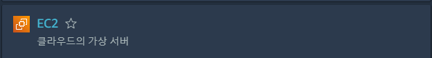

---

 

**인스턴스 시작을 누른다.**

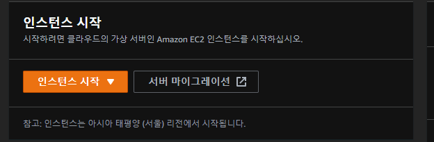

---

 

**AMI 를 사용할 것이기 때문에 Amazon Linux를 선택한다.**

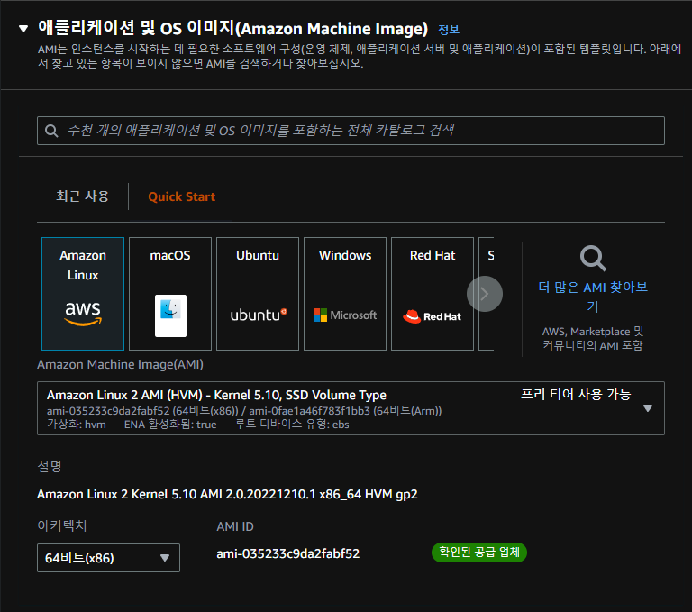

---

 

**t2.micro를 선택해야 프리티어를 지원해서 무료로 사용 가능.**

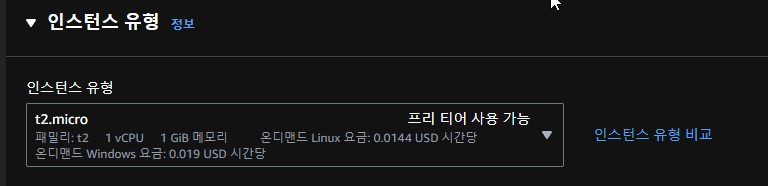

---

 

**새 키 페어 생성을 누른다.**

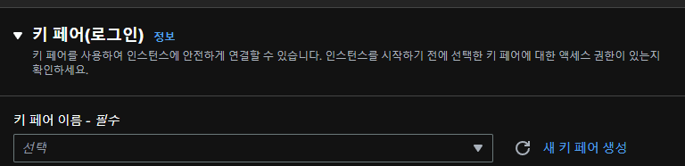

---

 

**키 페어 이름은 본인이 하고싶은 이름으로 정한다.**

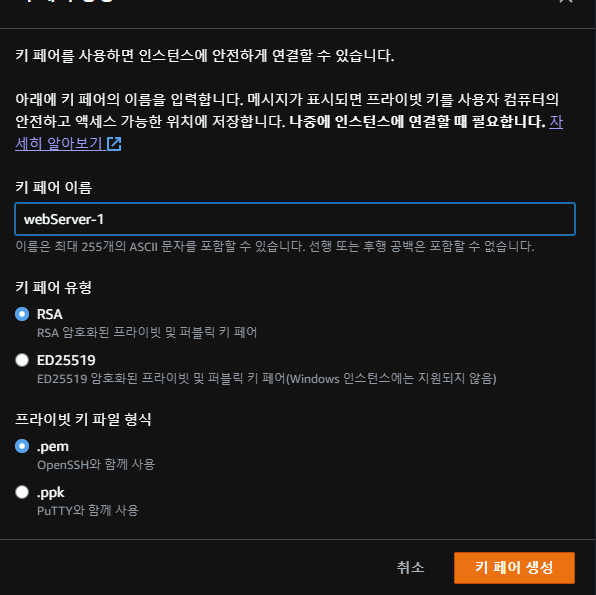

---

 

**빨갛게 하이라이트 친 부분을 "내 ip로 지정하기" 클릭한다.**

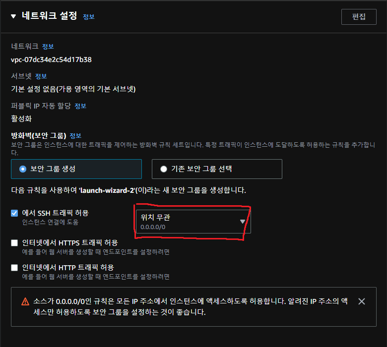

---

 

**기본 세팅 이대로 진행한다.**

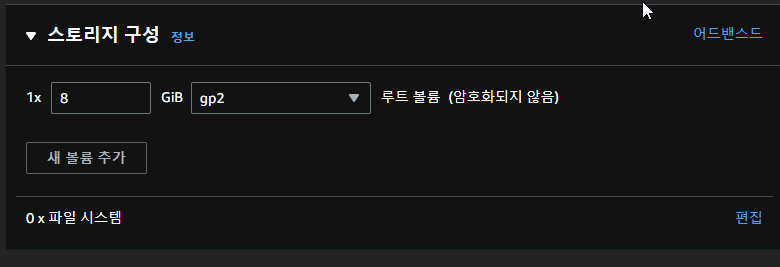

---

 

**인스턴스 시작 클릭.**

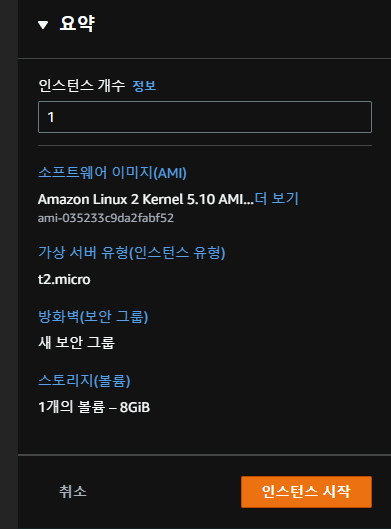

---

 

### 보안 규칙 추가하는 방법

**aws 사이트 왼쪽 사이드 바를 보면 인스턴스 카테고리가 있음.**

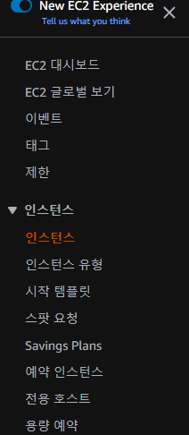

---

 

**인스턴스 ID 클릭.**
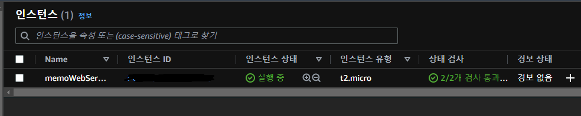

---

 

**보안탭 보안 그룹 들어가서 인바운드 규칙 추가 하기.**

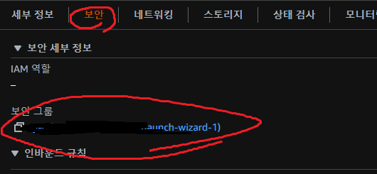
